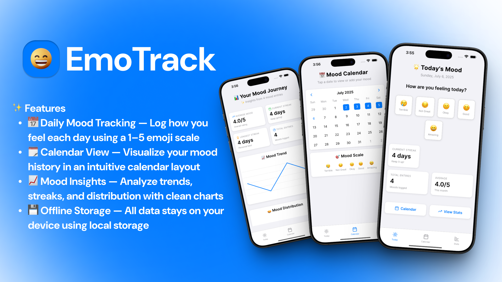

# 📊 EmoTrack - Track how you feel, one day at a time



A beautiful and intuitive mood tracking app built with React Native and Expo. Track your daily emotions, visualize patterns, and gain insights into your emotional well-being.

## ✨ Features

- **Daily Mood Tracking**: Record your mood on a 1-5 scale with intuitive emoji indicators
- **Beautiful Calendar View**: Visual calendar showing your mood history at a glance
- **Comprehensive Statistics**: Track your mood trends, streaks, and patterns
- **Data Visualization**: Beautiful charts and graphs powered by Victory charts
- **Offline Storage**: All data stored locally using AsyncStorage
- **Cross-Platform**: Works on iOS, Android, and Web
- **Modern UI**: Clean, modern interface with smooth animations


## 🚀 Getting Started

### Prerequisites

- Node.js (v16 or higher)
- npm or yarn
- Expo CLI
- iOS Simulator (for iOS development)
- Android Studio/Emulator (for Android development)

### Installation

1. **Clone the repository**
   ```bash
   git clone https://github.com/ItisSubham/EmoTrack
   cd EmoTrack
   ```

2. **Install dependencies**
   ```bash
   npm install
   ```

3. **Start the development server**
   ```bash
   npx expo start
   ```

4. **Run on your platform**
   - Press `i` for iOS simulator
   - Press `a` for Android emulator
   - Press `w` for web browser
   - Scan QR code with Expo Go app on your device

## 📂 Project Structure

```
EmoTrack/
├── app/                    # Main app screens and navigation
│   ├── (tabs)/            # Tab-based navigation screens
│   │   ├── index.tsx      # Home/Dashboard screen
│   │   ├── calendar.tsx   # Calendar view screen
│   │   └── stats.tsx      # Statistics screen
│   ├── _layout.tsx        # Root layout
│   └── +not-found.tsx     # 404 screen
├── components/            # Reusable UI components
│   ├── MoodCard.tsx       # Individual mood entry display
│   └── MoodSelector.tsx   # Mood selection interface
├── types/                 # TypeScript type definitions
│   └── mood.ts           # Mood-related interfaces
├── utils/                 # Utility functions
│   ├── storage.ts        # AsyncStorage operations
│   └── date.ts           # Date manipulation helpers
├── constants/            # App constants and themes
│   └── theme.ts          # Theme configuration
└── assets/               # Static assets (images, fonts)
```

## 🛠️ Built With

- **[React Native](https://reactnative.dev/)** - Mobile app framework
- **[Expo](https://expo.dev/)** - Development platform and tools
- **[Expo Router](https://docs.expo.dev/router/introduction/)** - File-based routing
- **[TypeScript](https://www.typescriptlang.org/)** - Type safety
- **[React Native Calendars](https://github.com/wix/react-native-calendars)** - Calendar component
- **[Victory Charts](https://formidable.com/open-source/victory/)** - Data visualization
- **[Lucide React Native](https://lucide.dev/)** - Beautiful icons
- **[AsyncStorage](https://react-native-async-storage.github.io/async-storage/)** - Local data persistence

## 📊 Mood Scale

The app uses a 5-point mood scale:

- 😢 **1 - Terrible**: Really struggling today
- 😔 **2 - Not Great**: Having a rough time
- 😐 **3 - Okay**: Feeling neutral or average
- 😊 **4 - Good**: Having a positive day
- 😄 **5 - Amazing**: Feeling fantastic!

## 📈 Statistics Tracked

- **Average Mood**: Your overall mood trend
- **Total Entries**: Number of days you've tracked
- **Current Streak**: Consecutive days of mood tracking
- **Longest Streak**: Your best tracking streak
- **Mood Distribution**: Breakdown of your mood patterns
- **Monthly Trends**: Mood patterns over time

## 🔧 Development

### Available Scripts

- `npm run dev` - Start development server
- `npm run build:web` - Build for web production
- `npm run lint` - Run ESLint

### Contributing

1. Fork the repository
2. Create a feature branch: `git checkout -b feature/amazing-feature`
3. Commit your changes: `git commit -m 'Add amazing feature'`
4. Push to the branch: `git push origin feature/amazing-feature`
5. Open a Pull Request

## 📱 Platform Support

- ✅ iOS
- ✅ Android  
- ✅ Web
- ⏳ Desktop (coming soon)

## 🔒 Privacy

EmoTrack respects your privacy:
- All data is stored locally on your device
- No data is sent to external servers
- No tracking or analytics
- Your mood data stays with you

## 📄 License

This project is licensed under the MIT License - see the [LICENSE](LICENSE) file for details.

## 🤝 Support

If you like EmoTrack, please consider:
- ⭐ Starring this repository
- 🐛 Reporting bugs
- 💡 Suggesting new features
- 🔀 Contributing to the codebase

## 📞 Contact

For questions, suggestions, or support:
- Create an issue on GitHub
- Email: subham712303@gamil.com

---

Made with ❤️ for better emotional well-being